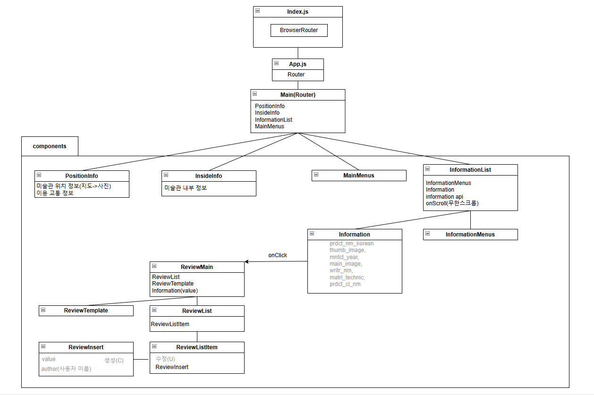
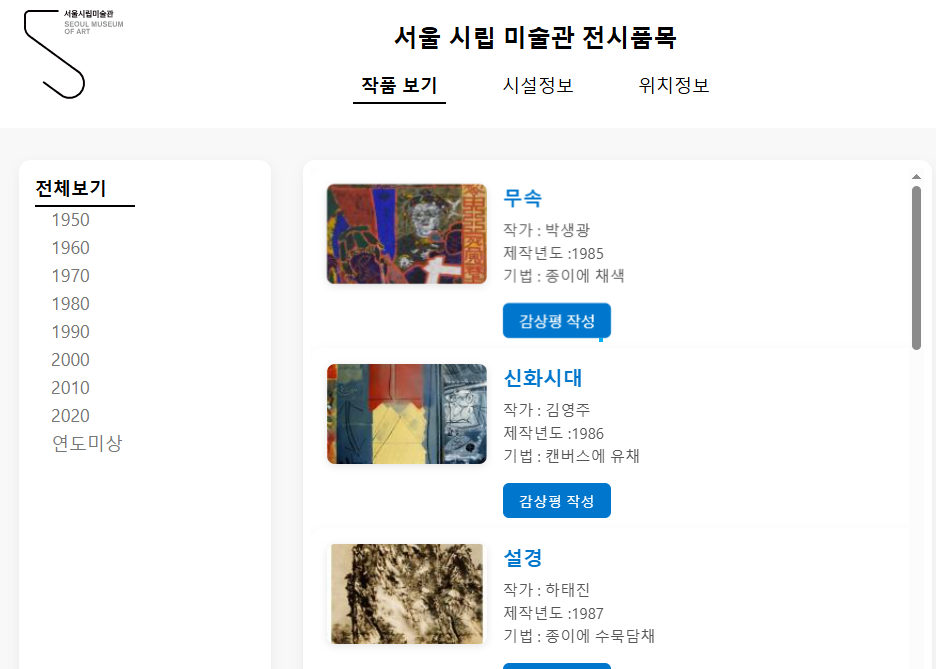
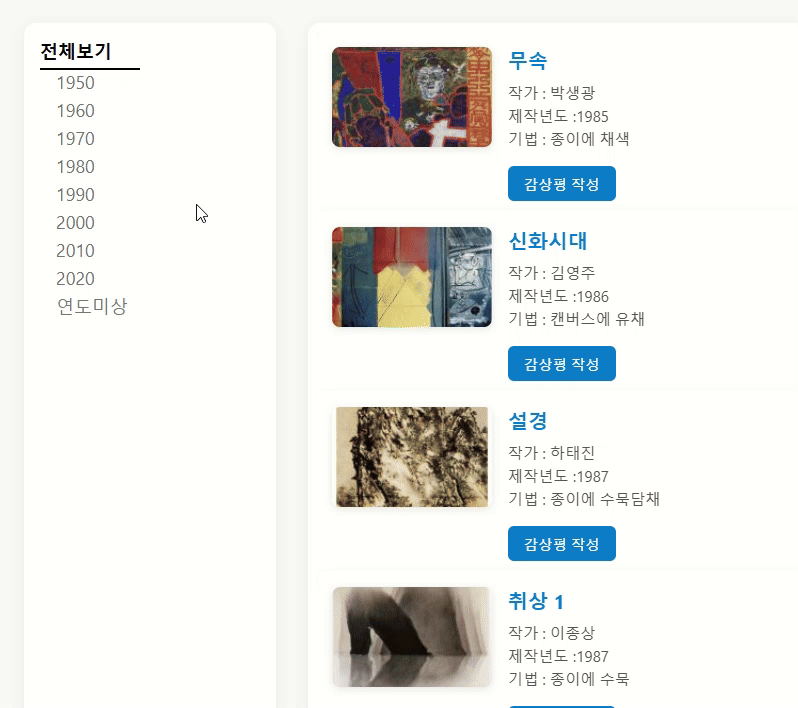

# artInfo프로젝트
서울 시립 미술관 전시목록 API를 활용한 서울 시립 미술관 사이트입니다. 
React를 기반으로 구현되었으며, 작품 목록과 감상평 작성 기능을 제공합니다.

이 프로젝트는 React 기반 SPA를 통한 외부 API 활용과 CRUD기능 구현을 목표합니다

---

## 주요 기능
- **작품 목록 조회**: 작가, 제작년도, 작품 설명등의 정보 제공
- **작품 제작 년도 별 목록 조회**: 작품 제작년도에 따른 작품 리스트 제공
- **감상평 작성**: 감성평 작성, 수정 및 삭제 기능
- **SPA(Single Page Application)**: React Router를 이용한 라우터

---

## 플로우 차트

---
## 구현 화면

> 작품의 기본 적인 정보와 전체 크기의 작품을 볼 수 있고, 연도 별로 작품을 볼 수 있습니다.
### 시연 영상
\

---
## 전체 메뉴

> 상단 메뉴를 통해 내 외부 정보를 알 수 있습니다.
---

## 📄 문서 보기
[PDF로 보기](https://github.com/jihyuk123979/front_reactProject/blob/main/ReactProject.pdf)
